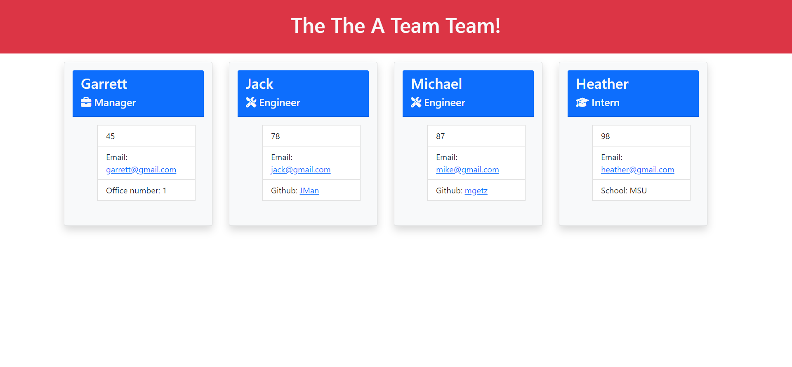

# Team-Site-Node-Gen

## Table of Contents:

- [Description](#description)

- [Installation](#installation)

- [Usage](#usage)

- [Credits](#credits)

- [Tests](#tests)

- [Contact](#contact)

- [Video Walkthrough](#video-walkthrough)

## Description

User story:

AS A manager
I WANT to generate a webpage that displays my team's basic info
SO THAT I have quick access to their emails and GitHub profiles

## Installation

npm i

## Usage

Run node index.js, then follow the prompts onscreen.

## Credits

N/A

## Tests

npm run test

## Contact

Contact me at my

- Github: https://github.com/GarrettA01

- Email: gman.anderson2001@gmail.com

for questions!

## Video Walkthrough

https://drive.google.com/file/d/1T-QPlETovrKvIbK6DIY_QAPq5rJkmARp/view?usp=sharing
